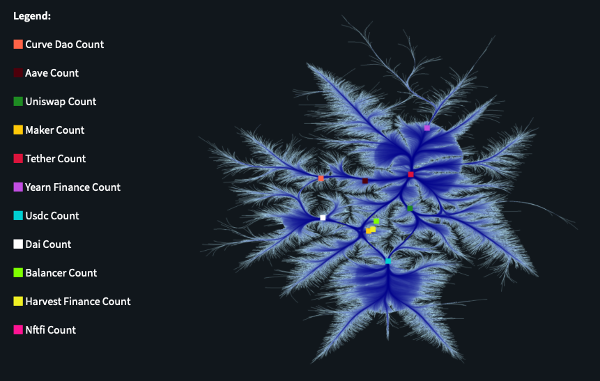
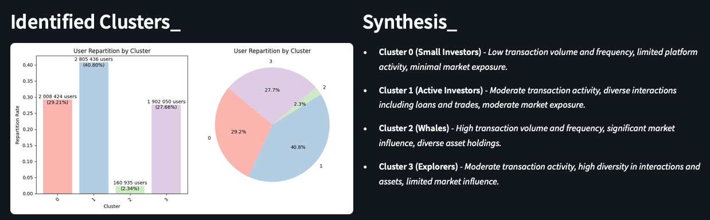
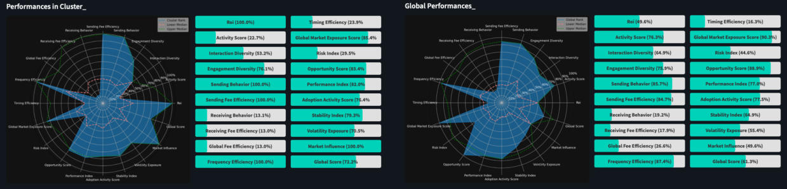

# DeFi Users Behavior Clustering

This project aims to analyze and cluster user behavior in decentralized finance (DeFi) platforms using open-source data. By examining user interactions, transaction patterns, and other relevant metrics, the goal is to uncover meaningful insights into how users engage with DeFi applications. These insights can help to improve platform designs, identify emerging trends, and provide valuable information for both developers and users within the DeFi ecosystem.

[](https://huggingface.co/collections/mriusero/defi-behavior-analysis-67a0d6d132ccecdff8068369)
[](https://huggingface.co/datasets/mriusero/DeFi-Protocol-Data-on-Ethereum-2023-2024)
[](https://mriusero-defi-behavior.hf.space)
[](https://huggingface.co/mriusero/DeFI-Behavior-Models)

---
## Scope of Analysis_

The scope of this analysis encompasses various decentralized finance (DeFi) protocols and platforms.   
Specifically, the study focuses on the following types of DeFi protocols on the `Ethereum blockchain`:

- **Decentralized Exchanges (DEX)**: *`Uniswap`, `Curve DAO`, `Balancer`*
- **Lending Platforms**: *`Aave`, `Maker`*
- **Stablecoins**: *`Tether`, `USD Coin (USDC)`, `Dai`*
- **Yield Farming**: *`Yearn Finance`, `Harvest Finance`*
- **Non-Fungible Token (NFT)**: *`NFTfi`*



---
## Data Collection_
The data used in this analysis is sourced from the Ethereum blockchain and all the data collection process is detailed in the section `Data Collection_` of the [HF Space](https://mriusero-defi-behavior.hf.space).  
Process include information on protocols, user transactions and average usages, protocol interactions or market metrics.

### Timeframe_ *(2 years: 2023-2024)*
* Start  -  `31st of December 2022, 22:59:59 UTC`
* End  -  `30th of December 2024, 23:00:11 UTC`

### Metrics_
- Total protocols (see scope above): `11` 
- Total unique transactions : `22 682 739` 
- Total unique users/addresses : `6 876 845` 
- Total market hours covered : `177 955`

### Storage_
All data are stored in Parquet format and are available in the [HF Dataset](https://huggingface.co/datasets/mriusero/DeFi-Protocol-Data-on-Ethereum-2023-2024/tree/main/dataset/data).  

    ├── contracts.parquet         # Contains contract details for selected DeFi protocols.
    ├── transactions.parquet      # Contains transaction data for Ethereum-based contracts.
    ├── market.parquet            # Contains enriched market data with aggregated transaction metrics.
    └── users.parquet             # User profiles based on transaction data.

---
## Features Engineering_
The features generated for each user address are detailed in the section `Feature Engineering_` of the [HF Space](https://mriusero-defi-behavior.hf.space).  
Process include the following steps and allows to obtain a total of `62 features` for each user address: 
1. Loading & Processing Data *(from .parquet files)*
2. Aggregating User Metrics, Transactions Data, Market Data
3. Standardizing Features *(with a specific method described in step 6 of the section)*

### Storage_
The features files are saved in arrow format and are also available in the [HF Dataset](https://huggingface.co/datasets/mriusero/DeFi-Protocol-Data-on-Ethereum-2023-2024/tree/main/dataset/data).

    ├── features.arrow                   # Contains the 62 features generated for each user address.
    └── features_standardised.arrow      # Contains the 62 features standardized following the process detailed in step 6.

---

## Clustering_
By identifying distinct clusters, we can gain insights into different user profiles and behaviors within the DeFi ecosystem.
To perform the clustering analysis, K-means algorithm is used to group users into clusters based on their features and transactional activities.

### Process_
1. **PCA**: reduce dimensions. Here, 6 sigmas of the variance is explained by 28 dimensions against 62 initially.
2. **Elbow Method**: analyze visually the optimal number of clusters for the K-means algorithm.
3. **Hyperparameters Tuning**: identify the optimal hyperparameters with Optuna.

### Results_
The analysis of main differences between each clusters is available in the section `Clustering_`of the [HF Space](https://mriusero-defi-behavior.hf.space). The clusters are described with their characteristics, interactions types, correlation matrix, transactions activity, diversity and influence, sent and received transactions statistics, exposure metrics and timing behavior.



---
## Performance Report_
As the final step of the project, the performance report delivers insights into a user's behavioral analysis. It includes a summary of the cluster analysis associated with the user, an evaluation of strengths and weaknesses within the DeFi ecosystem, and offers recommendations to enhance performance.

### Text-to-Text Reporting_
A text-to-text report is generated with `llama-3.3-70b-versatile`.  
The report includes an analysis of strengths, areas for improvement, and actionable recommendations to enhance performance.

### Metrics_
Metrics are displayed for global and cluster ranks. The radar charts provide a visual representation of the user's performance across various metrics, highlighting strengths and areas for improvement.


> [!NOTE]
> Experience available in the section `Performance Report_` of the [HF Space](https://mriusero-defi-behavior.hf.space).

---
# Run the App Locally
## Prerequisites
Before you begin, ensure you have the following software installed on your system:
- **Python 3.12+**: This project uses Python, so you'll need to have Python installed. You can download it from [python.org](https://www.python.org/).
- **uv**: This project uses `uv` for dependency management. Install it by following the instructions at [docs.astral.sh/uv](https://docs.astral.sh/uv/).
- **Docker** (Optional): If you prefer to run the project in a Docker container, ensure Docker is installed. Instructions can be found at [docker.com](https://www.docker.com/).

---
## Installation
Follow these steps to install and set up the project:

1. **Clone the Repository:**
   ```bash
   git clone https://github.com/mriusero/defi-user-behavior-clustering    # Clone the repository
   cd defi-user-behavior-clustering                                       # Access the project directory
   ```
   
2. **Create Virtual Environment:**  

   - **On MacOS/Linux:**
      ```bash
      python -m venv .venv         # Create a virtual environment
      source .venv/bin/activate    # Activate the virtual environment
      ```
   - **On Windows:**
      ```bash
      python -m venv .venv         # Create a virtual environment
      .venv\Scripts\activate       # Activate the virtual environment
      ```

3. **Install Dependencies:**
   ```bash
   pip install uv               # Install uv for dependency management
   uv sync                      # Install dependencies with uv
   ```
    This will install dependencies listed in `pyproject.toml`.
---
### Running Locally
To run the application locally, execute the following command:

```bash
 uv run streamlit run app.py
```
This will start the application, and you can access it in your web browser at [http://localhost:8501](http://localhost:8501).

### Running Locally with Docker
1. **Build the Docker Image:**
   ```bash
   docker build -t defi-behavior-app .
   ```
2. **Run the Docker Container:**
   ```bash
   docker run -p 8501:8501 defi-behavior-app
   ```
This will start the application, and you can access it in your web browser at [http://localhost:8501](http://localhost:8501).

---
## License
This project is licensed under the terms of the [MIT License](LICENSE). If you find this project helpful, please consider giving it a star or citing it in your work.